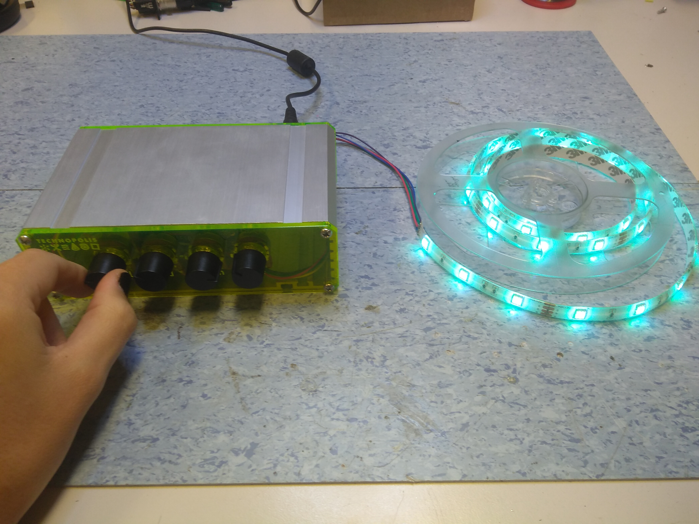
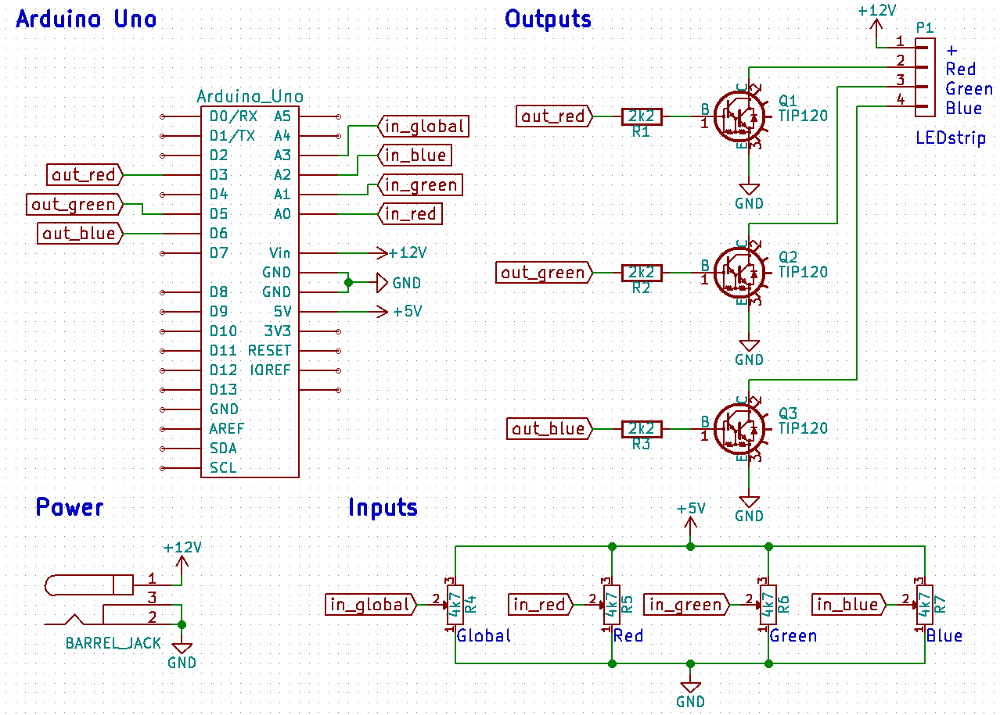
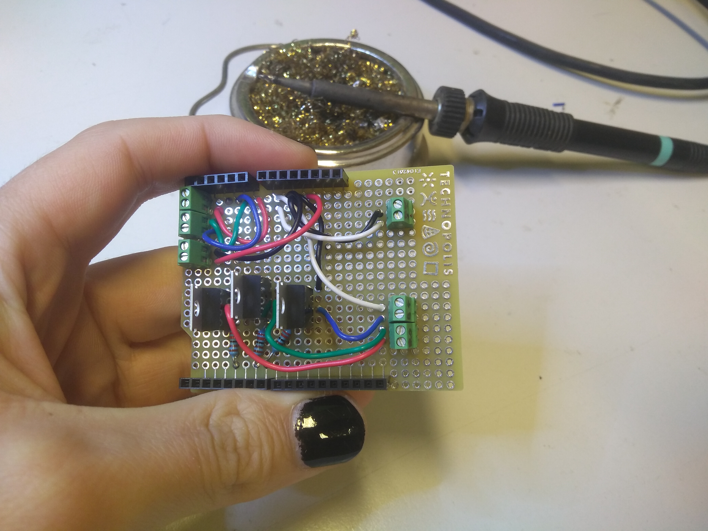
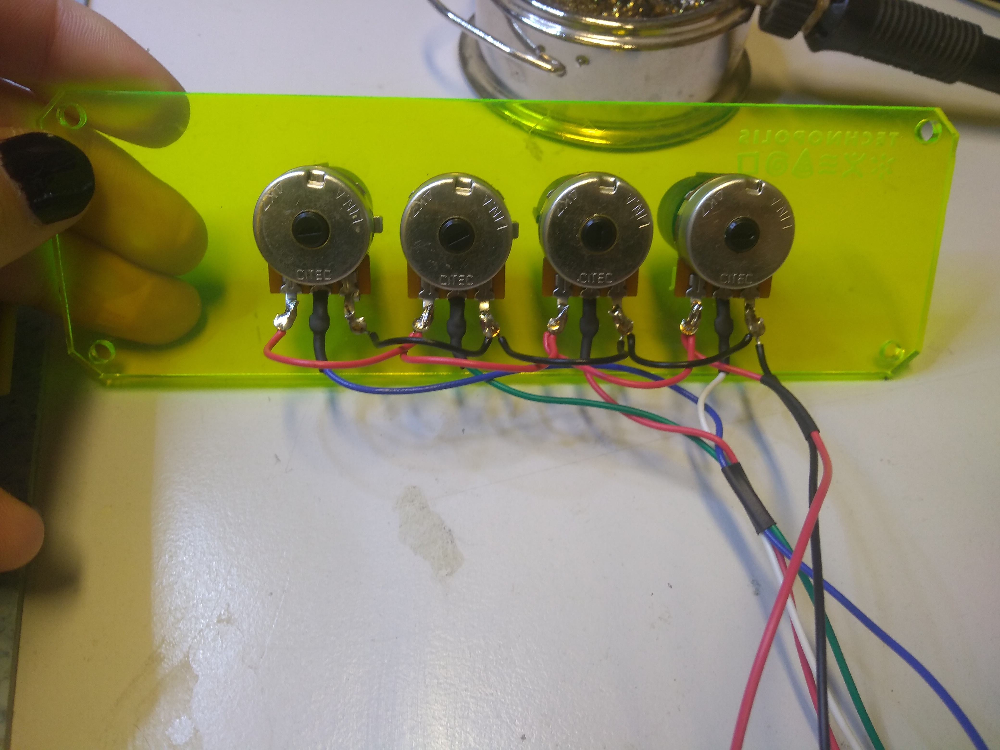

# RGB LEDstrip controller

Deze RGB LEDstrip controller maakt het mogelijk om de intensiteit van verschillende kleuren van een LEDstrip met rode, groene en blauwe LEDs in te stellen met draaiknoppen, alsook de globale intensiteit.
## Materiaallijst
* Arduino Uno Rev. 3 (of compatibel)
* Arduino Uno ProtoShield
* 3x 2K2 weerstanden
* 3x TIP 120 (NPN transistor)
* 4x 4k7 potentiometer (panel mount) + knoppen
* 12V LEDstrip (met common anode)
* Elektriciteitsdraad (liefst rood, groen, blauw, wit en zwart)
* 12V adapter

## Hardware

### Inputs - inlezen draaiknoppen
Om de intensiteit van de verschillende kleuren in te stellen gebruiken we potentiometers. Over de statische weerstand van de potentiometer zetten we 5V. De lopers van de potentiometers verbinden we met de analoge ingangen van de Arduino. Zo kunnen we de spanning op de analoge ingangen regelen tussen 0 en 5V doormiddel van het draaien aan de knoppen.

### Outputs - Aansturen LEDstrip
Om de intensiteit van het rode, groene en blauwe kanaal van de LEDstrip aan te sturen verbinden we ze met digitale uitgangen van de Arduino die PWM ondersteunen (Pulse Width Modulation). De meeste LEDstrips werken op 12V en met een een gemeenschappelijke +12V (ofwel “common anode”). Om het 5V uitgangssignaal van de Arduino te kunnen gebruiken om de 12V LEDs aan te sturen gebruiken we een transistor als schakelaar.

Dit is mijn afgewerkte schakeling op het ProtoShield. Ik gebruikte draadkleuren die representatief zijn voor hun functionaliteit, en schroefklemmen om het verbinden van de overige componenten die op de behuizing gemonteerd worden gemakkelijker te maken.

Ik heb voor dit project een oude behuizing hergebruikt. De voor- en achterkant van deze behuizing heb ik uitgetekend in CAD-software (FreeCAD), en aangepast voor deze toepassing. Ik heb deze met een lasersnijder laten graveren en uitsnijden. Hieronder de achterkant van mijn voorplaat, met daarop de bedraadde potentiometers
## Software
Het programma van de Arduino moet continu (loop) de waarde van de draaiknoppen inlezen (analogRead), en de intensiteit van de verschillende kleuren van de LEDstrip herberekenen en hieraan aanpassen (analogWrite). Het doet dit enkele keren per seconde (delay) zodat wanneer we aan een draaiknop draaien de intensiteit van de bijhorende kleur gelijkmatig bijgeregeld wordt.

